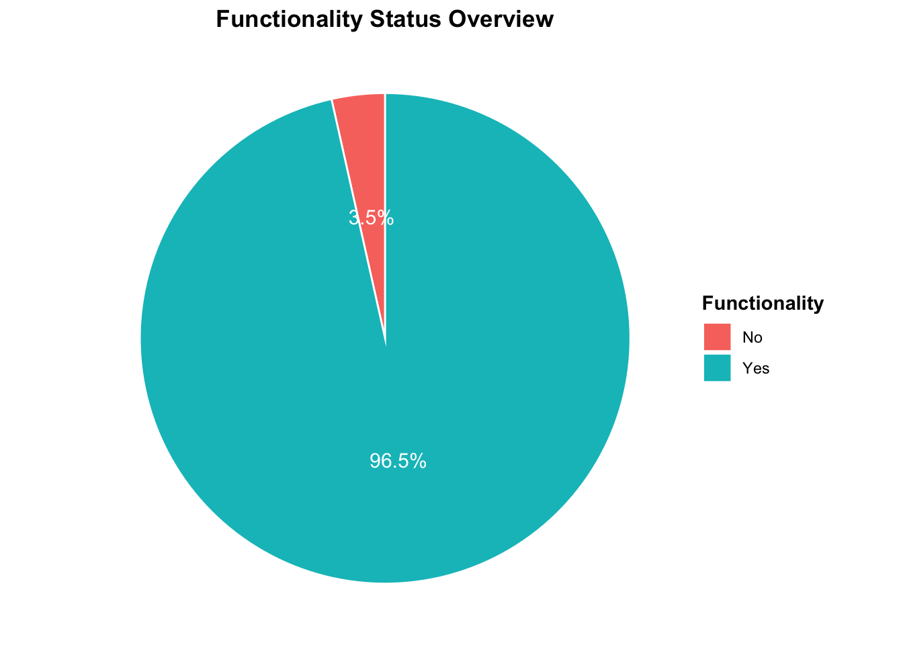
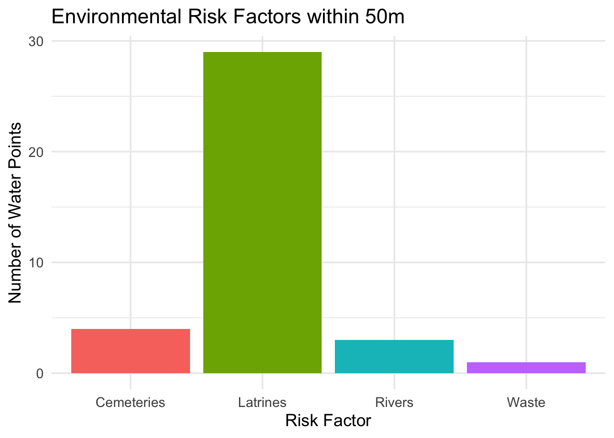

# Handpump Functionality Verification Survey - Chiradzulu, Malawi 2020

[](https://zenodo.org/doi/10.5281/zenodo.17474593)
[](https://github.com/openwashdata/handpumpstatusdata/actions/workflows/R-CMD-check.yaml)

This dataset contains detailed field survey records of borehole and
handpump functionality verification exercises conducted in Chiradzulu
District, Malawi in February 2020. Data was collected by BASEflow using
the mWater mobile data collection platform. Each record represents a
single site visit to a water point, capturing GPS coordinates, technical
assessments, water availability, environmental conditions, and
maintenance history.

The dataset includes:

- Identification & Location – Visit date, water point name/type,
  latitude, and longitude.

- Institutional Factors – Availability of government staff, committee
  permission for inspection.

- Functionality & Condition – Operational status, water availability,
  flow rate measurements, strokes to discharge, and mechanical
  condition.

- Environmental Hazards – Presence of latrines, cemeteries, waste,
  rivers, lakes, flood-prone areas, and difficult terrain within 50m.

- Repair & Maintenance History – Borehole age, manufacturer,
  installation details, prior repairs, spare parts required, and
  operational feel.

- Documentation – Photographs of the water point and repair parts.

**Purpose**

The dataset supports rural water supply monitoring, maintenance
planning, and public health risk assessments, contributing to efforts to
improve sustainability and reliability of community water points.

**Potential Users**

This dataset can be valuable to:

1.  **Local Governments** – For planning maintenance schedules and
    allocating resources to priority water points.

2.  **NGOs & Development Partners** – For designing interventions to
    improve rural water supply sustainability.

3.  **Researchers & Public Health Experts** – For studying the impact of
    infrastructure condition on water access and health outcomes.

4.  **Donors & Funding Agencies** – For monitoring the effectiveness of
    investments in water infrastructure.

5.  **Community-Based Organizations** – For advocating improved water
    services and mobilizing community-led repairs.

## Installation

You can install the development version of handpumpstatusdata from
[GitHub](https://github.com/) with:

``` r

# install.packages("devtools")
devtools::install_github("openwashdata/handpumpstatusdata")
```

``` r

## Run the following code in console if you don't have the packages
## install.packages(c("dplyr", "knitr", "readr", "stringr", "gt", "kableExtra"))
library(dplyr)
library(knitr)
library(readr)
library(stringr)
library(gt)
library(kableExtra)
```

Alternatively, you can download the individual datasets as a CSV or XLSX
file from the table below.

1.  Click Download CSV. A window opens that displays the CSV in your
    browser.
2.  Right-click anywhere inside the window and select “Save Page As…”.
3.  Save the file in a folder of your choice.

| dataset | CSV | XLSX |
|:---|:---|:---|
| handpumpstatusdata | [Download CSV](https://github.com/openwashdata/handpumpstatusdata/raw/main/inst/extdata/handpumpstatusdata.csv) | [Download XLSX](https://github.com/openwashdata/handpumpstatusdata/raw/main/inst/extdata/handpumpstatusdata.xlsx) |

## Data

This dataset contains detailed field survey records of borehole and
handpump functionality verification exercises conducted in Chiradzulu
District, Malawi in February 2020.

``` r

library(handpumpstatusdata)
```

### handpumpstatusdata

The dataset `handpumpstatusdata` has 57 observations and 46 variables

``` r

handpumpstatusdata |> 
  head(3) |> 
  gt::gt() |>
  gt::as_raw_html()
```

| visit_date | waterpoint_name | waterpoint_type | latitude | longitude | govt_staff_available | committee_permission | functionality_survey | status_changed | photo_waterpoint | water_available | latrines_within_50m | cemetery_within_50m | waste_within_50m | river_within_50m | lake_within_50m | flood_area | difficult_access | flowrate_possible | flowrate_seconds | strokes_to_discharge | water_available_today | reason_no_water | seasonal_variation | when_no_water | pumphead_disassemble | reason_no_disassemble | reason_no_disassemble_other | install_date | borehole_age | pump_manufacturer | pump_manufacturer_other | drilling_contractor | install_depth | static_water_level | pumping_test_info | drilling_report_info | water_quality_info | repaired_before | repair_attempts | borehole_issues | borehole_issues_other | operational_feel | operational_feel_other | parts_for_repair | photo_parts |
|---:|:---|:---|---:|---:|:---|:---|:---|:---|:---|:---|:---|:---|:---|:---|:---|:---|:---|:---|---:|---:|:---|:---|:---|:---|:---|:---|:---|---:|---:|:---|:---|:---|---:|---:|:---|:---|:---|:---|:---|:---|:---|:---|:---|:---|:---|
| 2/6/2020 | Chiradzulu trading borehole | Borehole or tubewell | -15.69984 | 35.18433 | Yes | Yes | Yes | Yes | <https://api.mwater.co/v3/images/bbb0e0df929e4a46afae416db498a85f> | Yes | Yes | No | No | Yes | No | No | No | Yes | 76.101 | 13 | Yes | NA | No | NA | Yes | NA | NA | 9/1/2001 | 19 | Ajay | NA | Mozagua | 32 | NA | No | No | No | Yes | Countless times | Other | Cylinder not ok, cupseal not ok | Normal/satisfactory | NA | Pump Head, Cup Seal , Fulcrum Pin, Rods, Civil works, Apron | <https://api.mwater.co/v3/images/8857037d61b7459696d528ca9a7337ad>; <https://api.mwater.co/v3/images/93fa669a39974dd488bf694e7f5fcd48>; <https://api.mwater.co/v3/images/9ee3085c01a14bb48a2fcb9f38360a32>; <https://api.mwater.co/v3/images/6307b17a465347379e5853498dedf1b8>; <https://api.mwater.co/v3/images/a007740c0dba42299343fb9984bd6875> |
| 2/10/2020 | Chanje 1 borehole | Borehole or tubewell | -15.76795 | 35.26584 | Yes | Yes | Yes | No | <https://api.mwater.co/v3/images/0e0d8a6496d04a8b92bfa7ca9844f52c> | Yes | No | No | No | No | No | No | No | Yes | 71.419 | 8 | Yes | NA | No | NA | Yes | NA | NA | 9/10/2013 | 9 | Other | Indo afro industries | China Ghasu | 52 | 226 | Yes | Yes | Yes | Yes | More than twice | Other | Fast waring parts such as bush bearings and load centilizers | Significant sideways movement on handle (loose/wobbly) | NA | Cup Seal , Fulcrum Pin, Bush Bearings, Centralisers | <https://api.mwater.co/v3/images/45b5e40d207e4ce6b371f8161d29e669>; <https://api.mwater.co/v3/images/edd84687a02b49abbe49406f5e3c5a98>; <https://api.mwater.co/v3/images/830cd0766b5c4fcbb083b691ac5609d6>; <https://api.mwater.co/v3/images/27a3368afa6140f39e5ad971c0c5dc4a>; <https://api.mwater.co/v3/images/324ee0af8f0a4e8e8d95b776864ad200> |
| 2/10/2020 | Baluwa2 borehole | Borehole or tubewell | -15.76260 | 35.25964 | Yes | Yes | Yes | No | <https://api.mwater.co/v3/images/78213ad7d1aa45a78d45ff7949ab7b40> | Yes | No | No | No | No | No | No | No | Yes | 79.673 | 5 | Yes | NA | No | NA | Yes | NA | NA | 2/21/2014 | 6 | Apex International | NA | Mozagua | 48 | 121 | Yes | Yes | Yes | Yes | More than 4 times | Other | Work out parts such as road centilizers and bush bearing and fulcrum pin | Significant sideways movement on handle (loose/wobbly) | NA | Bush Bearings, Fulcrum Pin, Centralisers | <https://api.mwater.co/v3/images/fa4085c66170401cac3b982bfddfd7d2>; <https://api.mwater.co/v3/images/29afa2c6fbc04b03ab64f69c9f46ca4a>; <https://api.mwater.co/v3/images/92b8a444a4244f7389d89c1191309a4c>; <https://api.mwater.co/v3/images/5e7b0546cbca45e38c228f93dfc225bc> |

For an overview of the variable names, see the following table.

| variable_name | variable_type | description |
|:---|:---|:---|
| visit_date | character | Date when the water point was visited for assessment. |
| waterpoint_name | character | Name or identifier of the water point being assessed. |
| waterpoint_type | character | Type of water point (e.g., borehole, well, tap). |
| latitude | numeric | Latitude coordinate of the water point. |
| longitude | numeric | Longitude coordinate of the water point. |
| govt_staff_available | character | Whether a government water sector staff member was present during the assessment. |
| committee_permission | character | Whether permission from the Water Point or Camp Committee was obtained before the assessment. |
| functionality_survey | character | Whether a water point functionality survey was conducted. |
| status_changed | character | Whether the water points functionality status has changed since the previous survey/mapping. |
| photo_waterpoint | character | Photo file or reference showing the water point. |
| water_available | character | Whether water was available from the water point at the time of visit. |
| latrines_within_50m | character | Whether there are latrines within 50 meters of the water point. |
| cemetery_within_50m | character | Whether there is a cemetery within 50 meters of the water point. |
| waste_within_50m | character | Whether there are waste dumps within 50 meters of the water point. |
| river_within_50m | character | Whether there is a river within 50 meters of the water point. |
| lake_within_50m | character | Whether there is a lake or large pond within 50 meters of the water point. |
| flood_area | character | Whether the water point is located in a known flood-prone area. |
| difficult_access | character | Whether accessing the water point is challenging. |
| flowrate_possible | character | Whether a flow rate test could be conducted at the water point. |
| flowrate_seconds | numeric | Time (in seconds) taken to fill a 20-liter bucket during the flow rate test. |
| strokes_to_discharge | numeric | Number of pump strokes needed before water starts flowing from the spout. |
| water_available_today | character | Whether water was available from the water point on the day of the visit. |
| reason_no_water | character | Reason water was not available during the visit. |
| seasonal_variation | character | Whether seasonal changes affect water availability from this source. |
| when_no_water | character | Specific times of the year when water is unavailable from the source. |
| pumphead_disassemble | character | Whether it was possible to disassemble the pump head during inspection. |
| reason_no_disassemble | character | Reason the pump head could not be disassembled. |
| reason_no_disassemble_other | character | Other specified reason why the pump head could not be disassembled. |
| install_date | character | Date when the borehole or water point was installed. |
| borehole_age | numeric | Approximate age of the borehole in years. |
| pump_manufacturer | character | Manufacturer of the installed pump. |
| pump_manufacturer_other | character | Other specified manufacturer if not listed in main options. |
| drilling_contractor | character | Contractor or company that drilled the borehole. |
| install_depth | numeric | Depth (in meters) of the borehole installation. |
| static_water_level | numeric | Static water level measurement (depth to water before pumping). |
| pumping_test_info | character | Whether original pumping test results are available. |
| drilling_report_info | character | Whether the original drilling report is available. |
| water_quality_info | character | Whether the original water quality test results are available. |
| repaired_before | character | Whether the borehole has been repaired multiple times in the past. |
| repair_attempts | character | Number of times the borehole has been repaired. |
| borehole_issues | character | Main issues affecting the boreholes performance. |
| borehole_issues_other | character | Other specified issues affecting the borehole. |
| operational_feel | character | General operational feel of the pump during use. |
| operational_feel_other | character | Other specified operational feel not covered in main categories. |
| parts_for_repair | character | Afridev pump parts that may need repair or replacement. |
| photo_parts | character | Photo file or reference of the Afridev pump parts inspected. |

## Example

``` r

library(handpumpstatusdata)

# Example 1: Pie Chart Functionality Status Overview
# Purpose: To show service availability.

# Load libraries
library(tidyverse)

# Filter out NA or empty values
data_filtered <- handpumpstatusdata %>%
  filter(!is.na(functionality_survey), functionality_survey != "")

# Summarise counts and calculate percentages
functionality_counts <- data_filtered %>%
  group_by(functionality_survey) %>%
  summarise(count = n(), .groups = "drop") %>%
  mutate(percent = round(100 * count / sum(count), 1),
         label = paste0(percent, "%"))

# Create pie chart with percentages
ggplot(functionality_counts, aes(x = "", y = count, fill = functionality_survey)) +
  geom_col(width = 1, color = "white") +
  coord_polar(theta = "y") +
  geom_text(aes(label = label),
            position = position_stack(vjust = 0.5), color = "white", size = 4) +
  labs(
    title = "Functionality Status Overview",
    fill = "Functionality"
  ) +
  theme_void() +
  theme(
    plot.title = element_text(hjust = 0.5, face = "bold"),
    legend.title = element_text(face = "bold")
  )
```



``` r


# Example 2: Environmental Risk Factors
# Purpose: Links potential contamination risks to water point locations.

# Load libraries
library(tidyverse)

# Select relevant environmental risk variables and reshape
risk_data <- handpumpstatusdata %>%
  select(waterpoint_name, 
         latrines_within_50m,
         cemetery_within_50m,
         waste_within_50m,
         river_within_50m,
         lake_within_50m) %>%
  pivot_longer(
    cols = -waterpoint_name,
    names_to = "risk_factor",
    values_to = "present"
  )

# Clean labels for risk factors
risk_data <- risk_data %>%
  mutate(
    risk_factor = recode(risk_factor,
                         latrines_within_50m = "Latrines",
                         cemetery_within_50m = "Cemeteries",
                         waste_within_50m = "Waste",
                         river_within_50m = "Rivers",
                         lake_within_50m = "Lakes")
  )

# Count presence of each risk factor
risk_counts <- risk_data %>%
  filter(!is.na(present), tolower(present) == "yes") %>%
  group_by(risk_factor) %>%
  summarise(count = n(), .groups = "drop")

# Stacked bar chart
ggplot(risk_counts, aes(x = risk_factor, y = count, fill = risk_factor)) +
  geom_bar(stat = "identity") +
  labs(
    title = "Environmental Risk Factors within 50m",
    x = "Risk Factor",
    y = "Number of Water Points"
  ) +
  theme_minimal(base_size = 14) +
  theme(legend.position = "none")
```



## License

Data are available as
[CC-BY](https://github.com/openwashdata/handpumpstatusdata/blob/main/LICENSE.md).

## Citation

Please cite this package using:

``` r

citation("handpumpstatusdata")
#> To cite package 'handpumpstatusdata' in publications use:
#> 
#>   Mhango E (2026). "handpumpstatusdata: Chiradzulu Handpump
#>   Functionality Verification Survey." doi:10.5281/zenodo.17474593
#>   <https://doi.org/10.5281/zenodo.17474593>.
#>   <https://github.com/openwashdata/handpumpstatusdata>.
#> 
#> A BibTeX entry for LaTeX users is
#> 
#>   @Misc{mhango:2026,
#>     title = {handpumpstatusdata: Chiradzulu Handpump Functionality Verification Survey},
#>     author = {Emmanuel Mhango},
#>     year = {2026},
#>     doi = {10.5281/zenodo.17474593},
#>     url = {https://github.com/openwashdata/handpumpstatusdata},
#>     abstract = {This dataset contains detailed field survey records of borehole and handpump functionality verification exercises conducted in Chiradzulu District, Malawi in February 2020.},
#>     keywords = {open data,washdata,handpumps,boreholes,water point functionality,water supply,Malawi,handpump,wash,waterpoints},
#>     version = {0.0.0.9000},
#>   }
```
